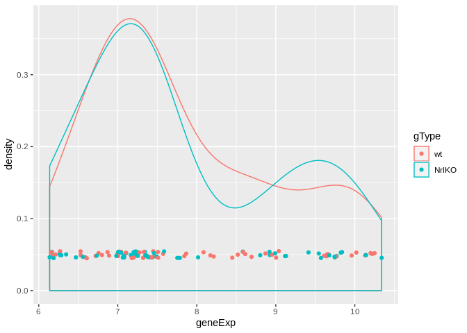

## Part 1: First time ggplot-ing

```
## ── Attaching packages ─────────────────────────────────────────────────────────────────────────────────────────────── tidyverse 1.2.1 ──
```

```
## ✔ ggplot2 3.1.0     ✔ purrr   0.2.5
## ✔ tibble  1.4.2     ✔ dplyr   0.7.8
## ✔ tidyr   0.8.2     ✔ stringr 1.3.1
## ✔ readr   1.2.1     ✔ forcats 0.3.0
```

```
## ── Conflicts ────────────────────────────────────────────────────────────────────────────────────────────────── tidyverse_conflicts() ──
## ✖ dplyr::filter() masks stats::filter()
## ✖ dplyr::lag()    masks stats::lag()
```

```
## # A tibble: 234 x 11
##    manufacturer model displ  year   cyl trans drv     cty   hwy fl    cla…
##    <chr>        <chr> <dbl> <int> <int> <chr> <chr> <int> <int> <chr> <ch>
##  1 audi         a4      1.8  1999     4 auto… f        18    29 p     com…
##  2 audi         a4      1.8  1999     4 manu… f        21    29 p     com…
##  3 audi         a4      2    2008     4 manu… f        20    31 p     com…
##  4 audi         a4      2    2008     4 auto… f        21    30 p     com…
##  5 audi         a4      2.8  1999     6 auto… f        16    26 p     com…
##  6 audi         a4      2.8  1999     6 manu… f        18    26 p     com…
##  7 audi         a4      3.1  2008     6 auto… f        18    27 p     com…
##  8 audi         a4 q…   1.8  1999     4 manu… 4        18    26 p     com…
##  9 audi         a4 q…   1.8  1999     4 auto… 4        16    25 p     com…
## 10 audi         a4 q…   2    2008     4 manu… 4        20    28 p     com…
## # ... with 224 more rows
```

<!-- -->

```
## `geom_smooth()` using method = 'loess' and formula 'y ~ x'
```

<!-- --><!-- --><!-- --><!-- -->

```
##  [1] "geom_abline"     "geom_area"       "geom_bar"       
##  [4] "geom_bin2d"      "geom_blank"      "geom_boxplot"   
##  [7] "geom_col"        "geom_contour"    "geom_count"     
## [10] "geom_crossbar"   "geom_curve"      "geom_density"   
## [13] "geom_density_2d" "geom_density2d"  "geom_dotplot"   
## [16] "geom_errorbar"   "geom_errorbarh"  "geom_freqpoly"  
## [19] "geom_hex"        "geom_histogram"  "geom_hline"     
## [22] "geom_jitter"     "geom_label"      "geom_line"      
## [25] "geom_linerange"  "geom_map"        "geom_path"      
## [28] "geom_point"      "geom_pointrange" "geom_polygon"   
## [31] "geom_qq"         "geom_qq_line"    "geom_quantile"  
## [34] "geom_raster"     "geom_rect"       "geom_ribbon"    
## [37] "geom_rug"        "geom_segment"    "geom_sf"        
## [40] "geom_sf_label"   "geom_sf_text"    "geom_smooth"    
## [43] "geom_spoke"      "geom_step"       "geom_text"      
## [46] "geom_tile"       "geom_violin"     "geom_vline"
```

```
##  [1] "stat_bin"            "stat_bin_2d"         "stat_bin_hex"       
##  [4] "stat_bin2d"          "stat_binhex"         "stat_boxplot"       
##  [7] "stat_contour"        "stat_count"          "stat_density"       
## [10] "stat_density_2d"     "stat_density2d"      "stat_ecdf"          
## [13] "stat_ellipse"        "stat_function"       "stat_identity"      
## [16] "stat_qq"             "stat_qq_line"        "stat_quantile"      
## [19] "stat_sf"             "stat_sf_coordinates" "stat_smooth"        
## [22] "stat_spoke"          "stat_sum"            "stat_summary"       
## [25] "stat_summary_2d"     "stat_summary_bin"    "stat_summary_hex"   
## [28] "stat_summary2d"      "stat_unique"         "stat_ydensity"
```

```
##  [1] "scale_alpha"               "scale_alpha_continuous"   
##  [3] "scale_alpha_date"          "scale_alpha_datetime"     
##  [5] "scale_alpha_discrete"      "scale_alpha_identity"     
##  [7] "scale_alpha_manual"        "scale_alpha_ordinal"      
##  [9] "scale_color_brewer"        "scale_color_continuous"   
## [11] "scale_color_discrete"      "scale_color_distiller"    
## [13] "scale_color_gradient"      "scale_color_gradient2"    
## [15] "scale_color_gradientn"     "scale_color_grey"         
## [17] "scale_color_hue"           "scale_color_identity"     
## [19] "scale_color_manual"        "scale_color_viridis_c"    
## [21] "scale_color_viridis_d"     "scale_colour_brewer"      
## [23] "scale_colour_continuous"   "scale_colour_date"        
## [25] "scale_colour_datetime"     "scale_colour_discrete"    
## [27] "scale_colour_distiller"    "scale_colour_gradient"    
## [29] "scale_colour_gradient2"    "scale_colour_gradientn"   
## [31] "scale_colour_grey"         "scale_colour_hue"         
## [33] "scale_colour_identity"     "scale_colour_manual"      
## [35] "scale_colour_ordinal"      "scale_colour_viridis_c"   
## [37] "scale_colour_viridis_d"    "scale_continuous_identity"
## [39] "scale_discrete_identity"   "scale_discrete_manual"    
## [41] "scale_fill_brewer"         "scale_fill_continuous"    
## [43] "scale_fill_date"           "scale_fill_datetime"      
## [45] "scale_fill_discrete"       "scale_fill_distiller"     
## [47] "scale_fill_gradient"       "scale_fill_gradient2"     
## [49] "scale_fill_gradientn"      "scale_fill_grey"          
## [51] "scale_fill_hue"            "scale_fill_identity"      
## [53] "scale_fill_manual"         "scale_fill_ordinal"       
## [55] "scale_fill_viridis_c"      "scale_fill_viridis_d"     
## [57] "scale_linetype"            "scale_linetype_continuous"
## [59] "scale_linetype_discrete"   "scale_linetype_identity"  
## [61] "scale_linetype_manual"     "scale_radius"             
## [63] "scale_shape"               "scale_shape_continuous"   
## [65] "scale_shape_discrete"      "scale_shape_identity"     
## [67] "scale_shape_manual"        "scale_shape_ordinal"      
## [69] "scale_size"                "scale_size_area"          
## [71] "scale_size_continuous"     "scale_size_date"          
## [73] "scale_size_datetime"       "scale_size_discrete"      
## [75] "scale_size_identity"       "scale_size_manual"        
## [77] "scale_size_ordinal"        "scale_type"               
## [79] "scale_x_continuous"        "scale_x_date"             
## [81] "scale_x_datetime"          "scale_x_discrete"         
## [83] "scale_x_log10"             "scale_x_reverse"          
## [85] "scale_x_sqrt"              "scale_x_time"             
## [87] "scale_y_continuous"        "scale_y_date"             
## [89] "scale_y_datetime"          "scale_y_discrete"         
## [91] "scale_y_log10"             "scale_y_reverse"          
## [93] "scale_y_sqrt"              "scale_y_time"
```

```
## `geom_smooth()` using method = 'loess' and formula 'y ~ x'
```

<!-- -->

```
## `geom_smooth()` using method = 'loess' and formula 'y ~ x'
```

<!-- -->

```
## `geom_smooth()` using method = 'loess' and formula 'y ~ x'
```

<!-- -->

```
## `geom_smooth()` using method = 'loess' and formula 'y ~ x'
```

<!-- -->

```
## # A tibble: 7 x 2
##   class      fuel_efficiency
##   <chr>                <dbl>
## 1 2seater               24.8
## 2 compact               28.3
## 3 midsize               27.3
## 4 minivan               22.4
## 5 pickup                16.9
## 6 subcompact            28.1
## 7 suv                   18.1
```

<!-- --><!-- --><!-- --><!-- -->

## Part 2: Deliverable

```r
ggplot(data = mpg) +
  geom_point(mapping = aes(x = displ, y = hwy, size = class, colour = drv)) 
```

```
## Warning: Using size for a discrete variable is not advised.
```

<!-- -->

## Part 3: Data visualization demos

```
##     sidChar sidNum devStage gType   probeset geneExp
## 1 Sample_20     20      E16    wt crabHammer  10.220
## 2 Sample_21     21      E16    wt crabHammer  10.020
## 3 Sample_22     22      E16    wt crabHammer   9.642
## 4 Sample_23     23      E16    wt crabHammer   9.652
## 5 Sample_16     16      E16 NrlKO crabHammer   8.583
## 6 Sample_17     17      E16 NrlKO crabHammer  10.140
```

<!-- --><!-- --><!-- --><!-- --><!-- --><!-- --><!-- -->
