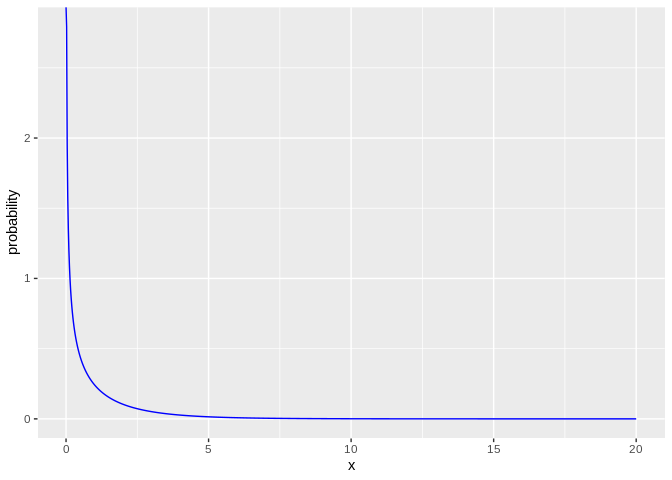
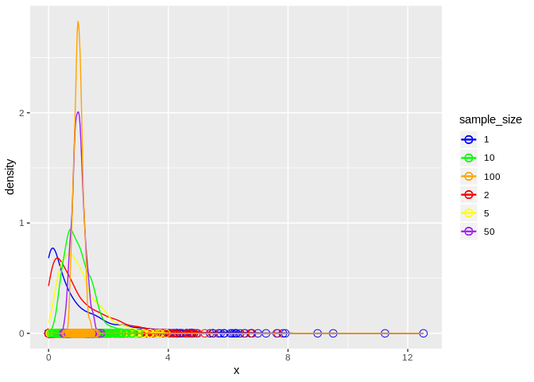

## Part 3: Deliverables

* How well does the CTL hold for smaller sample sizes? Try it with sample sizes of n = 5, keep the number of samples the same at 1000. Make a visual and show it to the TA to get checked off for completion.


```r
# the population distribution
degreeFreedom <- 1
xValues <- seq(from = 0, to = 20, length = 1000)
probabilityValues <- dchisq(xValues, df = degreeFreedom)
dataFrame <- tibble(x = xValues, 
                    probability = probabilityValues)
dataFrame %>% ggplot() +
  geom_line(aes(x = x, y = probability), color = "blue")
```

<!-- -->

```r
#plot the distribution of the sample means of random samples when 
# sample size are 1, 2, 5, 10 ,50 and 100 respectively
j <- 1
sz <- c(1, 2, 5, 10, 50, 100)
for (i in sz){
  set.seed(1)
  sampleSize <- i
  numSamples <- 1000
  degreeFreedom <- 1
  randomChiSqValues <- rchisq(n = numSamples * sampleSize, df = degreeFreedom)
  # organize the random values into 1000 sample rows of size n = i columns
  samples <- matrix(randomChiSqValues, nrow = numSamples, ncol = sampleSize)
  sampleMeans <- rowMeans(samples) # work out the sample means 
  if (j == 1){
    df <- data.frame (sampleMeans)
    j <- j + 1
  } else {
    df <- cbind(df, sampleMeans)
  }
} #construct a dataframe, each column represents the sample means when sample
  #size is 1, 2, 5, 10, 50, 100 respectively
names(df) <- c("sz1", "sz2", "sz5", "sz10", "sz50", "sz100") #name the df

#plot it!
df %>% 
  ggplot() + 
  geom_line(aes(x = sz1, color = "1"), stat = "density") +
  geom_point(aes(x = sz1, y = 0, color = "1"), shape = 1, size = 3) +
  geom_line(aes(x = sz2, color = "2"), stat = "density") +
  geom_point(aes(x = sz2, y = 0, color = "2"), shape = 1, size = 3) +
  geom_line(aes(x = sz5,  color = "5"), stat = "density") +
  geom_point(aes(x = sz5, y = 0, color = "5"), shape = 1, size = 3) +
  geom_line(aes(x = sz10, color = "10"), stat = "density") +
  geom_point(aes(x = sz10, y = 0, color = "10"), shape = 1, size = 3) +
  geom_line(aes(x = sz50, color = "50"), stat = "density") +
  geom_point(aes(x = sz50, y = 0, color = "50"), shape = 1, size = 3) +
  geom_line(aes(x = sz100, color = "100"), stat = "density") +
  geom_point(aes(x = sz100, y = 0, color = "100"), shape = 1, size = 3) +
  xlab("x") +
  scale_color_manual(values = c("1"= "blue", "2" = "red", "5" = "yellow", "10" = "green", "50" = "purple", "100" = "orange")) +
  labs(color = 'sample_size')
```

<!-- -->
