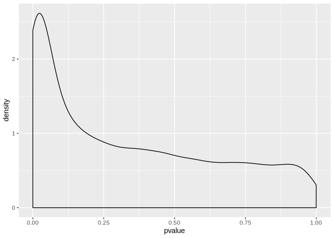

```r
library(GEOquery)
library(biomaRt)
library(tidyverse)
library(data.table)
library(reshape2)
```

# Part 1: download, extract and melt data

```r
gds <- getGEO("GDS507")
```

```
## File stored at:
```

```
## /tmp/RtmphdqMQL/GDS507.soft.gz
```

```
## Parsed with column specification:
## cols(
##   ID_REF = col_character(),
##   IDENTIFIER = col_character(),
##   GSM11815 = col_double(),
##   GSM11832 = col_double(),
##   GSM12069 = col_double(),
##   GSM12083 = col_double(),
##   GSM12101 = col_double(),
##   GSM12106 = col_double(),
##   GSM12274 = col_double(),
##   GSM12299 = col_double(),
##   GSM12412 = col_double(),
##   GSM11810 = col_double(),
##   GSM11827 = col_double(),
##   GSM12078 = col_double(),
##   GSM12099 = col_double(),
##   GSM12269 = col_double(),
##   GSM12287 = col_double(),
##   GSM12301 = col_double(),
##   GSM12448 = col_double()
## )
```

```r
meta_data <- data.frame(Sample = gds@dataTable@columns$sample, disease = gds@dataTable@columns$disease.state)
#we grab this info from the appropriate slots above. 
gds_data <- gds@dataTable@table

melted_data <- melt(gds_data, id.vars = c("ID_REF", "IDENTIFIER"), var = "Sample")
(new_melted_data <- melted_data %>% 
	group_by(Sample, IDENTIFIER) %>% 
	summarize(Count = mean(value)))
```

```
## # A tibble: 279,905 x 3
## # Groups:   Sample [?]
##    Sample   IDENTIFIER   Count
##    <fct>    <chr>        <dbl>
##  1 GSM11815 --Control   8139. 
##  2 GSM11815 222968_at    102. 
##  3 GSM11815 223641_at    200. 
##  4 GSM11815 224429_x_at 2385. 
##  5 GSM11815 224438_at     32.1
##  6 GSM11815 225714_s_at  291. 
##  7 GSM11815 225934_at    284. 
##  8 GSM11815 226014_at     66.3
##  9 GSM11815 226061_s_at   45.1
## 10 GSM11815 226138_s_at   23.3
## # … with 279,895 more rows
```

# Part 2: annotation with chromosome name

```r
#open connection between biomaRt and R. 
human = useMart("ensembl", dataset = "hsapiens_gene_ensembl")

#function that takes in data frame, and outputs same data frame with associated chromosome annotations, no transcript length
identify_gene_names_chromosome <- function(df){
	names(df) <- c("Sample", "hgnc_symbol", "Count")
	names <- getBM( attributes=c("hgnc_symbol", "chromosome_name") , filters= "hgnc_symbol", values = unique(df$hgnc_symbol), mart = human)
	left_join(df, names, by = "hgnc_symbol")
}
data_with_chromosome <- identify_gene_names_chromosome(new_melted_data) %>% 
	filter(chromosome_name %in% c(1:23, "X", "Y"))
head(data_with_chromosome)
```

```
## # A tibble: 6 x 4
## # Groups:   Sample [1]
##   Sample   hgnc_symbol Count chromosome_name
##   <fct>    <chr>       <dbl> <chr>          
## 1 GSM11815 A1BG        191.  19             
## 2 GSM11815 A1BG-AS1     53   19             
## 3 GSM11815 A1CF        188.  10             
## 4 GSM11815 A2MP1       442.  12             
## 5 GSM11815 AADACL2      14.9 3              
## 6 GSM11815 AADAT       448.  4
```

### Part 2: Exercise (average expression of genes on the X chromosome changes between RCC and normal cells)

```r
full_data <- left_join(data_with_chromosome, meta_data, by = "Sample")
```

```
## Warning: Column `Sample` joining factors with different levels, coercing to
## character vector
```

```r
full_data %>% 
	group_by(disease) %>% 
	filter(chromosome_name == "X") %>% 
	summarize(mean = mean(Count))
```

```
## # A tibble: 2 x 2
##   disease  mean
##   <fct>   <dbl>
## 1 normal   684.
## 2 RCC      657.
```

# Part 3: Graphing expression data

```r
#choose random number between 1 and however many genes we have. 
set.seed(5747540)
sample_to_choose <- sample(1:length(unique(full_data$hgnc_symbol)), size = 100)
#choose genes that correspond to those numbers in a list of genes. 
names_to_choose <- as.character(unique(full_data$hgnc_symbol)[sample_to_choose])
#graphing gene expression value of each sample in each chromosome
full_data %>% 
    filter(hgnc_symbol %in% names_to_choose) %>% 
    group_by(Sample) %>% 
    ggplot(aes(x = as.factor(chromosome_name), y = Count)) + geom_point()
```

<!-- -->

### Part 3: Exercise(calculate sum and percentage and plot)

```r
full_data %>% 
	filter(hgnc_symbol %in% names_to_choose) %>%
  group_by(Sample) %>%
  mutate(Sum = sum(Count), Percentage = Count/sum(Count)) %>%
  ggplot(aes(x = as.factor(chromosome_name), y = Percentage)) + geom_point()
```

<!-- -->

# Part 4 - Analyzing the results of statistical tests

```r
full_data %>% 
	group_by(hgnc_symbol) %>% 
	summarize( pvalue = t.test(Count ~ disease)$p.value)
```

```
## # A tibble: 9,359 x 2
##    hgnc_symbol pvalue
##    <chr>        <dbl>
##  1 A1BG        0.708 
##  2 A1BG-AS1    0.0366
##  3 A1CF        0.132 
##  4 A2MP1       0.0245
##  5 AADACL2     0.143 
##  6 AADAT       0.0304
##  7 AAGAB       0.469 
##  8 AAK1        0.0229
##  9 AARS2       0.0416
## 10 AASDH       0.0743
## # … with 9,349 more rows
```

### Part 4: Exercise (plot and extract gene with p < 0.05 and lowest pvalue)
1. Plot pvalue density

```r
full_data %>% 
	group_by(hgnc_symbol) %>% 
	summarize( pvalue = t.test(Count ~ disease)$p.value) %>%
  ggplot(aes(pvalue)) + geom_density()
```

<!-- -->

2. Extract genes with pvalue lower than 0.05

```r
full_data %>% 
	group_by(hgnc_symbol) %>% 
	summarize( pvalue = t.test(Count ~ disease)$p.value) %>%
  filter(pvalue < 0.05) %>%
  head()
```

```
## # A tibble: 6 x 2
##   hgnc_symbol  pvalue
##   <chr>         <dbl>
## 1 A1BG-AS1    0.0366 
## 2 A2MP1       0.0245 
## 3 AADAT       0.0304 
## 4 AAK1        0.0229 
## 5 AARS2       0.0416 
## 6 ABCB1       0.00351
```

3. Extract gene with lowest pvalue 

```r
pvalue_asce <- full_data %>% 
	group_by(hgnc_symbol) %>% 
	summarize( pvalue = t.test(Count ~ disease)$p.value) %>%
  arrange(pvalue)
pvalue_asce[1,1]
```

```
## # A tibble: 1 x 1
##   hgnc_symbol
##   <chr>      
## 1 CLDN2
```

4. Add transcript length

```r
#function that takes in data frame, and outputs same data frame with associated chromosome annotations and transcript length
identify_gene_names_chromosome_transcript <- function(df){
	names(df) <- c("Sample", "hgnc_symbol", "Count")
	names <- getBM( attributes=c("hgnc_symbol", "chromosome_name", "transcript_length") , filters= "hgnc_symbol", values = unique(df$hgnc_symbol), mart = human)
	left_join(df, names, by = "hgnc_symbol")
}
data_with_chromosome_transcript <- identify_gene_names_chromosome_transcript(new_melted_data) %>% 
	filter(chromosome_name %in% c(1:23, "X", "Y"))
head(data_with_chromosome_transcript)
```

```
## # A tibble: 6 x 5
## # Groups:   Sample [1]
##   Sample   hgnc_symbol Count chromosome_name transcript_length
##   <fct>    <chr>       <dbl> <chr>                       <int>
## 1 GSM11815 A1BG         191. 19                           2134
## 2 GSM11815 A1BG         191. 19                           1722
## 3 GSM11815 A1BG         191. 19                           2301
## 4 GSM11815 A1BG         191. 19                            475
## 5 GSM11815 A1BG         191. 19                            917
## 6 GSM11815 A1BG-AS1      53  19                           1718
```
