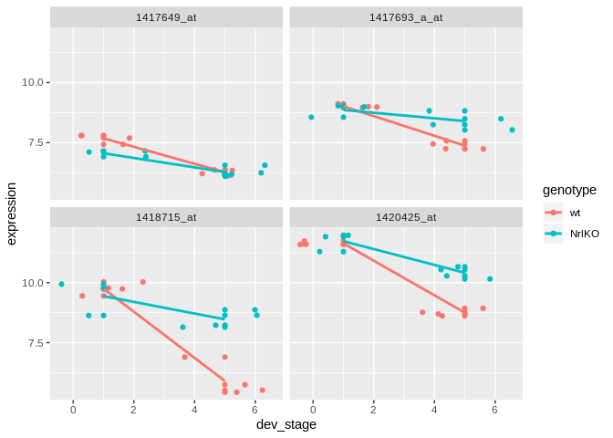

```r
library(limma)
library(tidyverse)
library(knitr)
library(reshape2)
```

# Exercise

```r
expressionMatrix <- read.table("expression_data/GSE4051_data.tsv", stringsAsFactors = FALSE, sep = "\t", 
                               quote = "")
expressionMatrix <- expressionMatrix %>% rownames_to_column("gene") # rownames deprecated in tibbles and are hard to work with in ggplot
expressionMatrix <- expressionMatrix %>% as_tibble() # turn into tibble for pretty printing

samplesMetadata <- read.table("expression_data/GSE4051_design.tsv", 
                              sep = "\t",
                              header = TRUE, # set header = TRUE to use the first row of the data as column names
                              stringsAsFactors = FALSE) # set stringAsFactors to avoid setting everything as factors, we can control that ourselves
samplesMetadata <- samplesMetadata %>% as_tibble() # turn into tibble for pretty printing

# define our own column names for samples metadata for clarity
names(samplesMetadata) <- c("sample_id", "sample_number", "dev_stage", "genotype")
samplesMetadata$dev_stage <- samplesMetadata$dev_stage %>% factor(levels = c("E16", "P2", "P6", "P10", "4_weeks"))
samplesMetadata$genotype <- samplesMetadata$genotype %>% factor(levels = c("wt", "NrlKO"))

transformGeneExpressionMatrix <- function(expressionMatrix) {
  expressionMatrix <- expressionMatrix %>%
    as.data.frame() %>% 
    column_to_rownames("gene") %>%
    t() %>% as.data.frame() %>% 
    rownames_to_column("sample_id") %>% 
    melt(id = "sample_id") %>% 
    as_tibble() %>% 
    select(sample_id,
           gene = variable, 
           expression = value)
  return(expressionMatrix)
}

# reusable function for pulling expression data for given samples
getExpressionForSamples <- function(sampleIds, expressionMatrix) {
  # use gene column as row name
  dataFrame <- expressionMatrix %>% 
    as.data.frame() %>% 
    column_to_rownames("gene")
  # use give sampleIds to pull out the subset of interest (ORDERING OF SAMPLES IS VERY IMPORTANT)
  return(dataFrame[sampleIds])
}


# for simplification, let's look at only a two-by-two design, we'll filter for developmental stages E16 and 4_weeks
interactionSamples <- samplesMetadata %>% filter(dev_stage %in% c("E16", "4_weeks"))

# IMPORTANT - you want to adjust factor levels here to eliminate stages P2, P6, and P10 from your design matrix
interactionSamples$dev_stage <- interactionSamples$dev_stage %>% 
  as.character() %>% 
  factor(levels = c("E16", "4_weeks"))

# reuse getExpressionForSamples() to get expression data for the samples that we want
expressionDataForInteractionSamples <- getExpressionForSamples(interactionSamples$sample_id, expressionMatrix)

# construct the design matrix to include all groups for genotype and developmental stages plus the interaction terms
interactionDesign <- model.matrix(~genotype*dev_stage, interactionSamples)

# first fit the model
interactionFit <- lmFit(expressionDataForInteractionSamples, interactionDesign) %>% eBayes()

cutoff <- 1e-06
changeDirections <- decideTests(interactionFit, p.value = cutoff, method = "global") %>% 
  as.data.frame() %>% 
  rownames_to_column("gene") %>% 
  as_tibble()

# look for down regulation across developmental stages in wt and genotypeNrlKO. No interaction between genotype 
# and development stage. `genotypeNrlKO:dev_stage4_weeks` == 0 means no interaction, 
#`genotypeNrlKO:dev_stage4_weeks` > 0 means opposite interaction,
# `genotypeNrlKO:dev_stage4_weeks` < 0 means same direction interaction. 
# dev_stage4_weeks < 0 means looking for down regulation in wt across development stage and so on.
hits <- changeDirections %>% filter(dev_stage4_weeks < 0, `genotypeNrlKO:dev_stage4_weeks` == 0)

# lets try plotting 5 on this list
expressionDataForHits <- expressionDataForInteractionSamples %>% 
  rownames_to_column("gene") %>% 
  filter(gene %in% hits$gene[1:4]) %>%
  transformGeneExpressionMatrix() %>% 
  left_join(samplesMetadata, id = "sample_id")
```

```
## Joining, by = "sample_id"
```

```r
expressionDataForHits$dev_stage <- expressionDataForHits$dev_stage %>% as.numeric()

expressionDataForHits %>%
  ggplot(aes(x = dev_stage, y = expression, color = genotype)) +
  geom_point() +
  geom_jitter() +
  geom_smooth(method = "lm", se = FALSE) +
  facet_wrap(~gene)
```

<!-- -->
