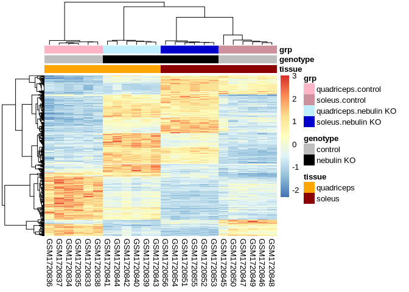
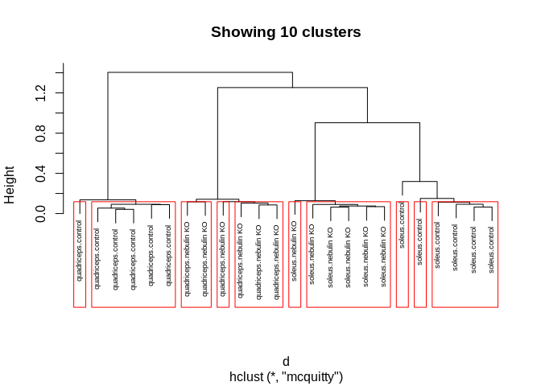
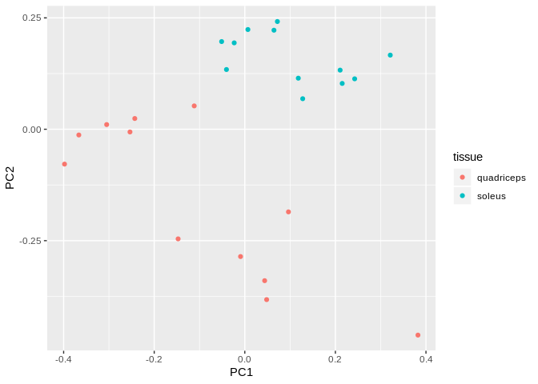

```r
library(RColorBrewer)
library(cluster)
library(pvclust)
library(xtable)
library(limma)
library(plyr)
library(lattice)
library(RCurl)
options('download.file.method'='curl')
library(GEOquery)
library(knitr)
library(pheatmap)
library(ggplot2)
library(grid)
library(gridExtra)
```

## Deliverables
### 1.Regenerate the pheatmap clustering plot for the top genes, selected from limma, using clustering distance: correlation, and clustering method: mcquitty.    

```r
if(file.exists("GSE70213.Rdata")){ # if previously downloaded
  load("GSE70213.Rdata")
} else { 
  #Get geo object that contains our data and phenotype information  
  geo_obj <- getGEO("GSE70213", GSEMatrix = TRUE)
  geo_obj <- geo_obj[[1]]
  save(geo_obj, file = "GSE70213.Rdata")
}
#Get expression data  
data <- exprs(geo_obj)
#Get covariate data  
prDes <- pData(geo_obj)[,c("organism_ch1","title",colnames(pData(geo_obj))[grep("characteristics", colnames(pData(geo_obj)))])]
##Clean up covariate data  
colnames(prDes) = c("organism","sample_name","tissue","genotype","sex","age")
prDes$tissue = as.factor(gsub("tissue: ","", prDes$tissue))
prDes$genotype = as.factor(gsub("genotype: ","", prDes$genotype))
prDes$sex = as.factor(gsub("Sex: ","", prDes$sex))
prDes$age = gsub("age: ","", prDes$age)

# scale data
sprDat <- t(scale(t(data)))
# create a new factor representing the interaction of tissue type and genotype
prDes$grp <- with(prDes, interaction(tissue, genotype))

# differential expression analysis by limma and output top genes
cutoff <- 1e-05
DesMat <- model.matrix(~grp, prDes)
dsFit <- lmFit(sprDat, DesMat)
dsEbFit <- eBayes(dsFit)
dsHits <- topTable(dsEbFit, coef = grep("grp", colnames(coef(dsEbFit))), p.value = cutoff, 
                   n = Inf)
numBHhits <- nrow(dsHits)
topGenes <- rownames(dsHits)

# Scaled data of topGenes
topDat <- sprDat[topGenes, ]

# colour setting
var1 = c("orange1", "darkred")
names(var1) = levels(prDes$tissue)
var2 = c("grey", "black")
names(var2) = levels(prDes$genotype)
var3 = c("pink1", "pink3", "lightblue1", "blue3")
names(var3) = levels(as.factor(prDes$grp))
covar_color = list(tissue = var1, genotype = var2, grp = var3)

# Regenerate the pheatmap clustering plot for the top genes, selected from limma, using clustering distance: correlation, and clustering method: mcquitty.
my_heatmap_obj = pheatmap(topDat, cluster_rows = TRUE, scale = "none", clustering_method = "mcquitty", 
                 clustering_distance_cols = "correlation", clustering_distance_rows = "correlation", 
                 annotation = prDes[, c("tissue", "genotype", "grp")], show_rownames = FALSE, 
                 annotation_colors = covar_color)
```

<!-- -->

### 2.Regenerate the dendrogram on the samples of this heatmap using the hclust and dist functions.

```r
# Regenerate the dendrogram on the samples of this heatmap
plot(my_heatmap_obj$tree_col, labels = prDes$grp, cex = 0.6, main = "Showing 10 clusters")
rect.hclust(my_heatmap_obj$tree_col, k = 10)
```

<!-- -->

### 3.Plot the data for this analyses along PCs 1 and 2 using ggplot instead base plotting. Color the points by tissue

```r
# run PCA
pcs <- prcomp(sprDat, center = FALSE, scale = FALSE)

# append the rotations for the first 10 PCs to the phenodata
prinComp <- cbind(prDes, pcs$rotation[rownames(prDes), 1:10])

# Plot the data for this analyses along PCs 1 and 2 using ggplot instead base plotting. Color the points by tissue
p<-ggplot(prinComp,aes(x=PC1,y=PC2,color=tissue ))+
  geom_point()
p
```

<!-- -->
