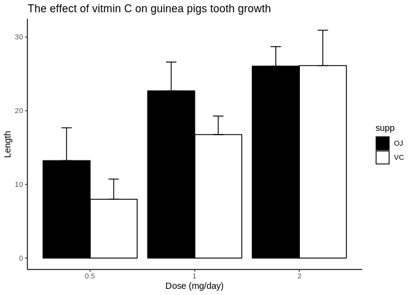

### 1.1 Passenger breakdown 

Convert the array into a data frame by using `data.frame()` function. 

```r
library(tidyverse) #load tidyverse
library(scales) #for percent() function
titanic <- data.frame(Titanic) #store in variable titanic as dataframe 
```

- How many children and adults were on Titanic? 

```r
child <- titanic %>% 
  filter(Age == "Child") %>% 
  select(Freq) %>% 
  sum()  #sum of all children

adult <- titanic %>% 
  filter(Age == "Adult") %>% 
  select(Freq) %>% 
  sum()  #sum of all adults

sprintf('children:%d adults:%d', child, adult) #print results
```

```
## [1] "children:109 adults:2092"
```
Conclusion: There are 109 children and 2092 adults.

- Were there more female adult or male adult passengers? 

```r
adult_male <- titanic %>% 
  filter(Age == "Adult" & Sex == "Male") %>% 
  select(Freq) %>% 
  sum()  #sum of all adult males

adult_female <- titanic %>% 
  filter(Age == "Adult" & Sex == "Female") %>% 
  select(Freq) %>% 
  sum()  #sum of all adult female

sprintf('adult male:%d adult female:%d', adult_male, adult_female) #print results
```

```
## [1] "adult male:1667 adult female:425"
```
Conclusion: There are more male adult passengers (1667) than female adult passengers (425).

### 1.2 Survival 

Using the same data frame, examine the survival rates.

- Did the children have better survival rate than the adults? 

```r
child_survived <- titanic %>% 
  filter(Age == "Child" & Survived == "Yes") %>% 
  select(Freq) %>% 
  sum()  #sum of all survived children

child_survival_rate <- child_survived/child    #calculate children survival rate

adult_survived <- titanic %>% 
  filter(Age == "Adult" & Survived == "Yes") %>% 
  select(Freq) %>% 
  sum() #sum of all survived adults

adult_survival_rate <- adult_survived/adult   #calculate adults survival rate

sprintf('children survival rate:%s adult survival rate:%s', percent(child_survival_rate), 
        percent(adult_survival_rate)) #print results
```

```
## [1] "children survival rate:52.3% adult survival rate:31.3%"
```
Conclusion: Children have better servival rate (52.3%) than adults (31.3%).

- Which class of passengers have a better survival rate? (Crew, first class, second class, third class)

```r
survival_rate <- c()  #define SurvivalRate as an empty vector
for (i in c("Crew", "1st", "2nd", "3rd")){
  survived <- titanic %>% filter(Class == i & Survived == "Yes") %>% select(Freq) %>% sum()    
  all <- titanic %>% filter(Class == i) %>% select(Freq) %>% sum() 
  survival_rate <- c(survival_rate, survived/all)
}   #calculate the survival rate for each class in the order of crew, 1st, 2nd, 3rd
names(survival_rate) <- c("Crew", "1st", "2nd", "3rd")  #name the vector in the order of Crew, 1st, 2nd, 3rd
survival_rate
```

```
##      Crew       1st       2nd       3rd 
## 0.2395480 0.6246154 0.4140351 0.2521246
```
Conclusion: 1st (62.5%) have better survival rate, followed by 2nd (41.4%), 3rd (25.2%), Crew (24.0%).

## 2. Data visualization

- PLot bar graph


```r
tooth_growth <- read.table('guinea_pigs_tooth_growth.txt',header = TRUE)  #read table

tooth_growth$dose <- as.factor(tooth_growth$dose) # Convert dose to a factor variable

#define a function to get mean and sd of several groups
#varname is the name of a column containing the variable to be summariezed
#groupnames is the vector of column names to be used as grouping variables
data_summary <- function(data, varname, groupnames){ 
  require(plyr)
  data_sum<-ddply(data, groupnames,                  
                  .fun = function(x, col){            
                    c(mean = mean(x[[col]], na.rm=TRUE),
                      sd = sd(x[[col]], na.rm=TRUE)
                      )
                    },
                  varname)  
  data_sum <- rename(data_sum, c("mean" = varname)) # rename the "mean" with varname
  return(data_sum)
}

tooth_growth_summary<- data_summary(ToothGrowth, varname="len", 
   groupnames=c("supp", "dose"))     #apply data_summary function to get mean and sd by supp and dose grouping

tooth_growth_summary$dose=as.factor(tooth_growth_summary$dose) # Convert dose to a factor variable


ggplot(tooth_growth_summary, aes(x=dose, y=len, fill=supp)) +      
  geom_bar(stat="identity", color="black", position=position_dodge()) +  #create bar plot
  geom_errorbar(aes(ymin=len, ymax=len+sd), width=.2,    
                position=position_dodge(.9)) +              #add error bar
  labs(title="The effect of vitmin C on guinea pigs tooth growth", 
       x="Dose (mg/day)", y = "Length")+
  theme_classic() +
  scale_fill_manual(values=c('#000000','#FFFFFF'))   #define lable, title, colour
```

<!-- -->

- Conclusions: 
1. From the plot, it seems that there is a positive correlationship between dose and tooth growth length. 
2. In terms of delivery methods, orange juice(OJ) seems more effective than ascorbic acid(VC) at dose 
  level 0.5mg/day and 1mg/day. No difference between OJ and VC at 2mg/day dose level.
3. VC showed continued increase of length by dose, while OJ showed decreased effectivity along with increasing dose.

- Two-way Anova application:

```r
tooth_growth_aov <- aov(len ~ supp + dose + supp:dose, data = tooth_growth)
summary(tooth_growth_aov)
```

```
##             Df Sum Sq Mean Sq F value   Pr(>F)    
## supp         1  205.4   205.4  15.572 0.000231 ***
## dose         2 2426.4  1213.2  92.000  < 2e-16 ***
## supp:dose    2  108.3    54.2   4.107 0.021860 *  
## Residuals   54  712.1    13.2                     
## ---
## Signif. codes:  0 '***' 0.001 '**' 0.01 '*' 0.05 '.' 0.1 ' ' 1
```
Overall, there is significant difference (p<0.05) in the impact of dose level and deliveray method respectively. In addition, there is interaction between 
dose level and delivery methods.

- Tukey’s Honest Significant Differences (HSD) test

```r
TukeyHSD(tooth_growth_aov, which = "dose")
```

```
##   Tukey multiple comparisons of means
##     95% family-wise confidence level
## 
## Fit: aov(formula = len ~ supp + dose + supp:dose, data = tooth_growth)
## 
## $dose
##         diff       lwr       upr   p adj
## 1-0.5  9.130  6.362488 11.897512 0.0e+00
## 2-0.5 15.495 12.727488 18.262512 0.0e+00
## 2-1    6.365  3.597488  9.132512 2.7e-06
```
So we can coclude that both 1mg/day and 2mg/day are more effective than 0.5mg/day on tooth growth.


```r
TukeyHSD(tooth_growth_aov, which = "supp:dose")
```

```
##   Tukey multiple comparisons of means
##     95% family-wise confidence level
## 
## Fit: aov(formula = len ~ supp + dose + supp:dose, data = tooth_growth)
## 
## $`supp:dose`
##                diff        lwr        upr     p adj
## VC:0.5-OJ:0.5 -5.25 -10.048124 -0.4518762 0.0242521
## OJ:1-OJ:0.5    9.47   4.671876 14.2681238 0.0000046
## VC:1-OJ:0.5    3.54  -1.258124  8.3381238 0.2640208
## OJ:2-OJ:0.5   12.83   8.031876 17.6281238 0.0000000
## VC:2-OJ:0.5   12.91   8.111876 17.7081238 0.0000000
## OJ:1-VC:0.5   14.72   9.921876 19.5181238 0.0000000
## VC:1-VC:0.5    8.79   3.991876 13.5881238 0.0000210
## OJ:2-VC:0.5   18.08  13.281876 22.8781238 0.0000000
## VC:2-VC:0.5   18.16  13.361876 22.9581238 0.0000000
## VC:1-OJ:1     -5.93 -10.728124 -1.1318762 0.0073930
## OJ:2-OJ:1      3.36  -1.438124  8.1581238 0.3187361
## VC:2-OJ:1      3.44  -1.358124  8.2381238 0.2936430
## OJ:2-VC:1      9.29   4.491876 14.0881238 0.0000069
## VC:2-VC:1      9.37   4.571876 14.1681238 0.0000058
## VC:2-OJ:2      0.08  -4.718124  4.8781238 1.0000000
```
Based on these significantly different comparison, delivery by orage juice with high dosage is more effective.


- Why you choose to present the data in this way. 

By bar graph with error bar, we can easily visulize the overall effect of dose on tooth growth. Combine delivery methods OJ and VC together, we can compare the difference between OJ and VC at the three dose levels. The error bar provides information of variation. 


